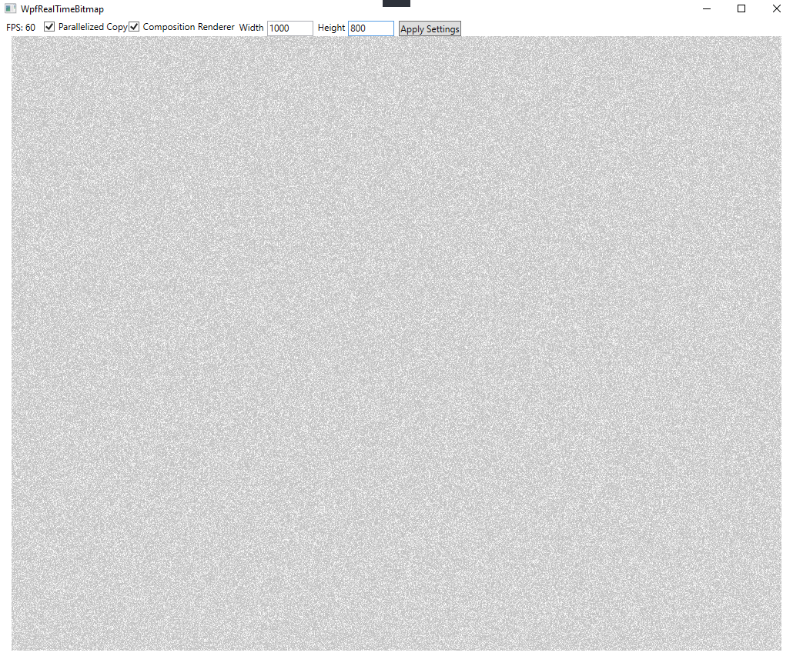

# WpfRealTimeBitmap
Demo to test WPF's `WriteableBitmap`'s realtime capabilities

This application creates a backing image `ColorScaleImage` with randomized values scaled from 0 to 1. These values are translated into greyscale as they are mapped to WPF's `WriteableBitmap` which can be directly shown on screen. This process is repeated for every frame up to WPF's default limit of 60 fps.

Major concepts demonstrated
* Convert a custom image type to a `WriteableBitmap` so it can be displayed
* Efficiently use pointers to move data into `WriteableBitmap`
* Parallelize the conversion process
* Use `CompositionTarget.Rendering` to improve render timing compared to `DispatcherTimer`

